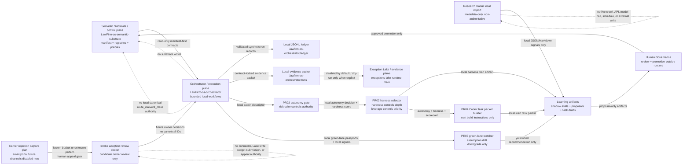
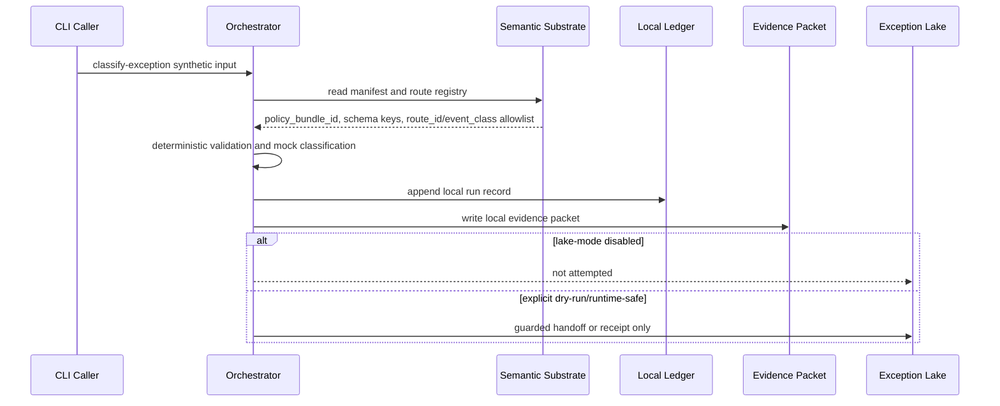

# Data Flow Map

## Summary

Canonical machine name: `LawFirm-os-orchestrator`. Plane: execution.

This repo consumes the Semantic Substrate read-only, validates model/tool outputs, writes local ledgers, builds local evidence packets, and may optionally prepare dry-run or guarded handoff artifacts for the Exception Lake. It does not define canon, mutate the substrate, promote governance changes, or authorize production automation.

## Contract Flow

```text
Semantic Substrate manifest
-> orchestrator read-only substrate client
-> canonical route/event allowlist
-> synthetic classify-exception workflow
-> structured validation
-> local JSONL ledger
-> local evidence packet
-> Exception Lake disabled/not_attempted by default
```

The substrate manifest is loaded first from `manifests/contract_manifest.v1.json`. Required fields include `policy_bundle_id`; loading fails closed when required fields are missing.

## Mermaid Flowchart



## Mermaid Sequence



## Current Commands

- `classify-exception`
- `classify-autonomy`
- `select-harness`
- `watch-green-lanes`
- `generate-codex-task`
- `research-radar import-local`
- `research-radar list-signals`
- `learning run-shadow-eval`
- `learning build-upgrade-proposal`
- `learning render-codex-task`
- `learning score-insight`

See `ENDPOINTS_AND_COMMANDS.md` for command details.

## Phase 2 Status

Implemented locally:

- offline eval and metrics spine
- governed learning object models
- local-only Research Radar import
- algorithm/method insight scoring
- shadow eval runner
- upgrade proposal packet builder
- action recommendations and inert Codex task drafts
- learning-loop CLI surfaces
- safety regression suite
- PR02 autonomy gate and harness selector
- PR03 green-lane assumption watcher
- PR04 inert Codex task packet builder
- candidate-only intake Orchestrator adoption review docket
- future carrier rejection capture plan with deterministic unknown bucket, human appeal gate, and budget actuals comparison inputs

Still non-authoritative and local-only:

- Research Radar source metadata in `config/research_sources.yaml`
- learning proposals, recommendations, and task drafts
- autonomy decisions, hardness scores, leverage scores, and harness plans
- green-lane watch recommendations and reclassification evidence
- Codex task packets and inert agent review plans
- intake owner review docket entries and carrier rejection capture plans
- all Phase 2 upgrade and decision-support artifacts

## Hard Prohibitions

- no Semantic Substrate writes
- no route/event-class invention
- no real client or matter data
- no live Research Radar automation
- no live web crawling
- no scheduled jobs
- no live model calls
- no external APIs
- no external writes
- no production connectors
- no automatic code mutation or Git operations from inside the app
