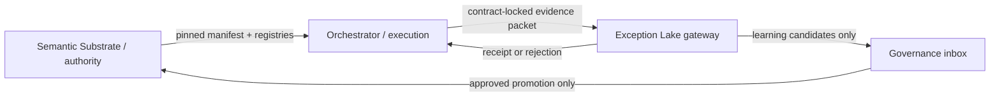

# Architecture

The Orchestrator coordinates runs. It does not define truth.

## AI Strategy Doctrine Dependency

- Orchestrator consumes AI strategy doctrine from `../../LawFirm-os-semantic-substrate/governance/AI_STRATEGY_DOCTRINE.md`.
- Orchestrator may use Legal Context Bundles as pre-model context artifacts.
- Orchestrator emits Evidence Packets as post-model runtime evidence.
- Orchestrator must not define canonical strategy doctrine, context-quality schemas, entropy metric IDs, institutional-knowledge authority, route IDs, or event classes.
- Orchestrator must fail closed or escalate when context quality, provenance, privilege, permission, contract pin, or prompt integrity is insufficient.
