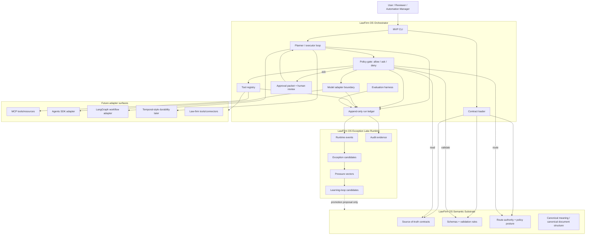

# Clean Export of the Idea Featured in This Conversation

## Project name

**LawFirm OS Orchestrator**

## One-line label

**Contract-governed orchestration for law-firm AI systems — not an agent swarm demo.**

## Purpose of this export

This file is a clean, portable seed of the LawFirm OS Orchestrator idea. It is written so it can be pasted into a new chat, handed to a technical collaborator, or used as the high-level project brief before asking Codex or another coding assistant to build the first repository.

The central idea is simple but important:

> Law-firm AI orchestration should be governed by contracts, schemas, policy gates, audit records, and runtime evidence — not by whatever a model call happens to produce.

The Orchestrator is the planned execution layer in a three-plane LawFirm OS architecture:

1. **LawFirm OS Semantic Substrate** — the control and meaning plane.
2. **LawFirm OS Exception Lake Runtime** — the runtime evidence and audit plane.
3. **LawFirm OS Orchestrator** — the model, tool, workflow, approval, and agent coordination plane.

The Orchestrator coordinates work. It does not define truth.

---

## Core positioning

LawFirm OS Orchestrator is not a general-purpose agent swarm. It is a bounded orchestration layer for legal operations and law-firm AI systems.

Its job is to:

- load pinned contracts from the Semantic Substrate,
- validate inputs and outputs against declared schemas,
- route model/tool calls through policy gates,
- build reviewable evidence packets,
- write runtime evidence into Exception Lake,
- fail closed when authority or evidence is missing,
- preserve human approval for risky actions,
- keep the system ready for future MCP, Agents SDK, LangGraph, and durable workflow integration.

Its job is **not** to:

- create canonical legal meaning,
- mutate schema authority,
- bypass governance,
- ingest real client data in the public MVP,
- act as a lawyer,
- automate law practice,
- send communications,
- mutate billing or matter systems,
- allow uncontrolled subagents.

---

## Why this matters

Many AI orchestration demos start with the exciting part: many agents, many tools, long reasoning loops, autonomous actions, and impressive-looking workflows.

That is the wrong starting point for a law-firm AI system.

Law-firm orchestration needs a different design center:

- **truth must be governed,**
- **evidence must be captured,**
- **runtime traces must be auditable,**
- **model outputs must remain proposals,**
- **human approval must remain explicit,**
- **automation must start narrow.**

The key failure mode is not merely that a model gives a bad answer. The key failure mode is that model output, retrieval context, tool output, or runtime observations silently become operational truth without provenance, review, or promotion discipline.

LawFirm OS Orchestrator exists to prevent that failure mode.

---

## Three-plane architecture

### 1. Semantic Substrate — source of authority

The Semantic Substrate owns:

- canonical semantic meaning,
- schemas,
- registries,
- route authority,
- governance boundaries,
- policy posture,
- validation contracts,
- promotion rules.

The Orchestrator reads from the Substrate. It does not rewrite it.

### 2. Exception Lake Runtime — source of runtime evidence

The Exception Lake Runtime owns:

- validated runtime events,
- exception events,
- audit records,
- policy outcomes,
- validation outcomes,
- learning-loop candidates,
- pressure vectors,
- evidence for future improvement proposals.

The Orchestrator writes runtime evidence to Exception Lake through supported boundaries. Runtime evidence can become a candidate for improvement, but it does not automatically mutate canonical truth.

### 3. Orchestrator — source of execution coordination

The Orchestrator owns:

- workflow execution,
- model/tool routing,
- bounded tool invocation,
- run state,
- run ledgers,
- approval pauses,
- evidence-packet assembly,
- evaluation harnesses,
- retry/time/cost budgets,
- future adapter seams.

The Orchestrator coordinates action under contracts.

---

## Architecture diagram



---

## Design doctrine

### 1. Orchestration needs semantic governance

A law-firm AI workflow cannot be governed by a model's intuition. Before any model or tool acts, the system must know:

- what contract governs the task,
- what schema defines valid input/output,
- what route authority applies,
- what evidence is required,
- what approval rule applies,
- what data class is allowed,
- what must be logged,
- what happens if evidence is missing.

The Orchestrator therefore starts every run by loading pinned contracts and validating authority. If the authority is missing, stale, or ambiguous, the run should stop.

### 2. Model calls should not define truth

A model call is a runtime event. It can produce a useful draft, classification, summary, or route suggestion. But it is not canonical truth.

Model outputs are treated as:

- proposals,
- draft classifications,
- evidence summaries,
- suggested actions,
- approval-packet drafts,
- exception hypotheses.

They do not mutate the Semantic Substrate. Canonical change requires a promotion decision.

### 3. Runtime evidence belongs in Exception Lake

Runtime behavior is valuable, but it belongs in an evidence system rather than the canonical substrate.

The Orchestrator should write:

- run IDs,
- contract pins,
- validation results,
- model-call records,
- tool-call records,
- policy denials,
- approval decisions,
- exception candidates,
- evidence packet manifests,
- audit events,
- failure reasons.

These records support review, audits, learning loops, and future improvement proposals.

### 4. The orchestrator starts small

The first version should prove the governance loop, not build every future capability.

The MVP should be:

- local-first,
- synthetic-only,
- CLI-driven,
- read-only by default,
- deterministic where possible,
- schema-bound,
- append-only in its ledgers,
- fail-closed,
- usable without a web app,
- usable without live firm data.

### 5. Avoid agent sprawl

The Orchestrator should not spawn uncontrolled agents.

Rules:

1. Every agent or specialist is registered.
2. Every agent has a narrow scope.
3. Every agent has a risk tier.
4. Every tool is allowlisted.
5. Every side effect is gated.
6. Every material step emits evidence.
7. Every loop has budgets and stop conditions.
8. No raw runtime output becomes canon.

### 6. Future integration is adapter-based

The Orchestrator should be ready for:

- **MCP** as a tool/resource protocol,
- **OpenAI Agents SDK** as a possible runner for agent loops, approvals, tracing, structured outputs, and MCP access,
- **LangGraph** as a future stateful graph workflow adapter,
- **Temporal-style durability** later if workflows need long-running resumability, retries, and external approval waits.

But none of these frameworks should become the semantic authority.

The Orchestrator should own its own domain contracts, run ledger, policy decisions, approval records, and evidence packet model.

---

## MVP command

Canonical first MVP command:

```bash
python -m lawfirm_os_orchestrator classify-exception \
  --input examples/synthetic_exception_event.json
```

Optional console-script equivalent:

```bash
lawfirm-os-orchestrator classify-exception \
  --input examples/synthetic_exception_event.json
```

Expected MVP behavior:

1. Load config and contract pin.
2. Load a synthetic exception input.
3. Validate input schema.
4. Load read-only substrate manifest/registry fixture.
5. Validate route/event authority.
6. Run a mock classifier by default.
7. Produce structured classification output.
8. Build a proposed evidence packet manifest.
9. Write an append-only JSONL run ledger.
10. Optionally perform dry-run Exception Lake handoff.
11. Exit with explicit status: `success`, `blocked`, `needs_review`, or `failed_validation`.

Example terminal output:

```json
{
  "run_id": "lfos-run-2026-000001",
  "workflow": "classify-exception",
  "mode": "synthetic_test_only",
  "contract_status": "validated",
  "policy_status": "allowed_readonly",
  "classification_status": "proposed",
  "evidence_status": "packet_created",
  "side_effects": "none",
  "ledger_path": ".lawfirm-os-orchestrator/ledger/classify_exception.jsonl",
  "evidence_packet_path": ".lawfirm-os-orchestrator/runs/lfos-run-2026-000001/evidence_packet_manifest.json"
}
```

---

## MVP roadmap

### Phase 0 — repo skeleton

- `src/` package layout
- `pyproject.toml`
- CLI entry point
- basic config loader
- synthetic examples
- test fixtures

### Phase 1 — contracts and validation

- read-only substrate adapter
- pinned manifest loader
- schema validation
- route/event registry validation
- fail-closed behavior on missing authority

### Phase 2 — classification pipeline

- mock model adapter
- structured classifier output schema
- deterministic validation
- confidence band and abstain path
- one bounded optional repair attempt only for malformed output

### Phase 3 — evidence and ledgers

- append-only JSONL run ledger
- evidence packet manifest
- input/output hashing
- run ID, trace ID, correlation ID
- policy and validation results preserved

### Phase 4 — Exception Lake dry-run boundary

- disabled by default
- dry-run only
- synthetic ingest adapter
- validation result captured
- no live production writes

### Phase 5 — approval packet prototype

- `ask` path for risky or ambiguous actions
- human approval record schema
- statuses: `approve`, `reject`, `approve_with_conditions`
- no live side effects yet

### Phase 6 — future adapters

- OpenAI structured-output adapter
- Agents SDK runner adapter
- MCP tool client adapter
- LangGraph workflow adapter
- Temporal-style durability later if justified by actual runtime pressure

---

## Quality architecture

The quality model is Six Sigma-inspired, adapted for law-firm AI operations.

### Define

Define what “good orchestration” means for each workflow:

- task charter,
- risk tier,
- CTQ attributes,
- evidence requirements,
- approval matrix,
- defect taxonomy,
- rollback path.

### Measure

Every run should measure:

- run defect rate,
- validation failure rate,
- evidence completeness,
- fail-closed rate,
- approval compliance,
- unsupported-claim rate,
- policy denial rate,
- median and p95 latency,
- cost per completed run,
- rework rate.

### Analyze

Use run ledgers and exception candidates to identify recurring failure modes:

- wrong route,
- invalid event class,
- missing evidence,
- stale contract pin,
- unsupported claim,
- tool authorization failure,
- approval bypass attempt,
- malformed model output.

### Improve

Improvements should be controlled changes, not silent runtime adaptation:

- prompt update,
- schema update proposal,
- route update proposal,
- validator addition,
- policy update,
- tool contract change,
- approval rule change.

### Control

Prevent quality drift through:

- contract validation,
- policy gates,
- run budgets,
- append-only ledgers,
- evaluation fixtures,
- canary release posture,
- rollback triggers,
- promotion decisions.

Core CTQs:

| CTQ | Meaning |
|---|---|
| Contract conformance | Inputs, outputs, tool calls, and state transitions match declared contracts. |
| Legal grounding | Material outputs are supported by approved evidence paths. |
| Controlled autonomy | The system stays inside its authorized action envelope. |
| Provenance completeness | A reviewer can reconstruct what happened. |
| Human-governed finality | High-impact transitions require human approval. |
| Security/privacy containment | Runs do not cross matter, tenant, or secret boundaries. |
| Recovery/resilience | Defects are contained without cascading failures. |
| Cost/time discipline | Quality is achieved inside bounded operating envelopes. |

---

## Bottleneck-first design

The first bottleneck to attack is **trusted review capacity at the governance boundary**.

The goal is not to maximize model calls. The goal is to maximize accepted, decision-ready proposed exception packets per reviewer hour.

Primary throughput unit:

> **Accepted proposed exception packets per reviewer hour.**

An accepted packet is:

- contract-pinned,
- route-valid,
- event-class-valid,
- schema-valid,
- evidence-sufficient,
- provenance-complete,
- approval-complete when needed,
- admissible through the Exception Lake boundary.

What is not throughput:

- number of agents,
- number of model calls,
- prompt length,
- dashboards,
- raw event count,
- token volume,
- autonomous actions.

---

## Safety boundaries

The public MVP must not:

- ingest real client documents,
- use live matter data,
- send client communications,
- mutate billing records,
- submit portal actions,
- update canonical ontology truth,
- create production memories,
- bypass access controls,
- train models on firm data,
- claim legal correctness,
- claim production answer quality,
- act as a lawyer.

The MVP is synthetic and dry-run only.

---

## Repository role

This repository should demonstrate:

- AI platform architecture,
- contract-first engineering,
- semantic governance,
- legal AI safety boundaries,
- model/tool adapter abstraction,
- MCP-ready tool architecture,
- human-in-the-loop workflow design,
- policy-gated execution,
- run-ledger and audit design,
- provenance-aware orchestration,
- exception-driven learning-loop design,
- Six Sigma-inspired quality control,
- MVP discipline.

The project signal is:

> This is governed AI infrastructure, not prompt choreography.

---

## Recommended public README tagline

**LawFirm OS Orchestrator coordinates AI workflows under contracts, policy gates, evidence capture, and human approval. It treats model output as proposal, runtime traces as evidence, and canonical meaning as something owned upstream by the Semantic Substrate.**

---

## License note

Recommended default before public code release:

```text
Code: MIT License
Documentation: CC BY 4.0
Examples: synthetic only; no client, matter, privileged, or confidential data
```

Until a license file is added, treat the repository as **all rights reserved**.

---

## Source material summarized into this export

This clean export is synthesized from the LawFirm OS Orchestrator README concept and the uploaded architecture materials covering:

- Architecture contract and repo role split
- MVP repository design
- Six Sigma-inspired quality architecture
- Bottleneck-first operating model
- Data-flow architecture
- Technology decision record
- World-class orchestration patterns for 2026

The export intentionally removes research scaffolding and keeps the project idea portable, public-safe, and ready to seed another chat or a coding assistant.
