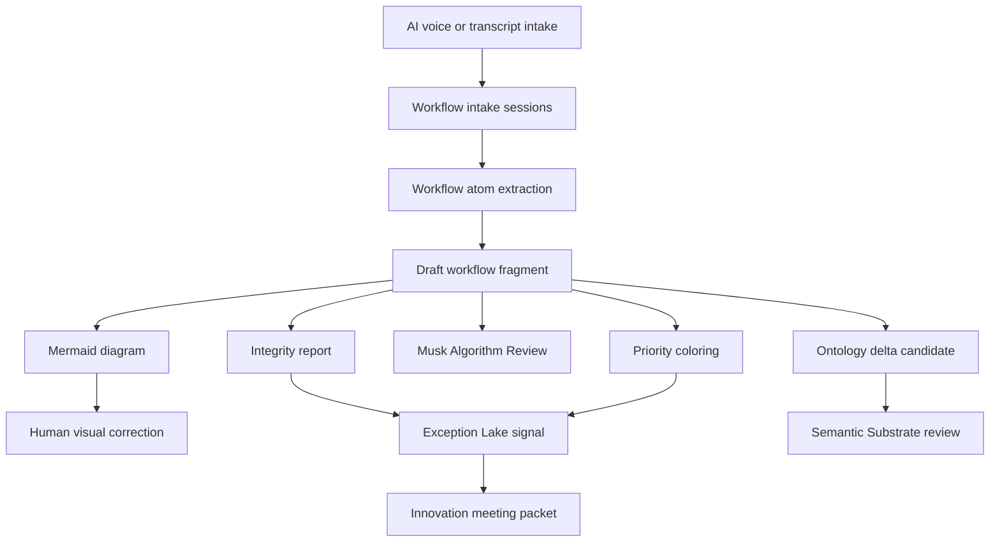

# Workflow Atlas Architecture

## Product

Workflow Atlas is the LawFirm OS layer that turns short AI-guided voice/text intakes into workflow fragments, diagrams, ontology candidates, Exception Lake signals, and innovation meeting prep packets.

## Core flow

## Boundary

Workflow Atlas may extract, diagram, question, score, package, and propose.

Workflow Atlas may not create canonical route IDs, create event classes, mutate the Semantic Substrate, ingest raw transcripts into the Exception Lake, or approve digital-twin truth.

## Exception Lake fit

Workflow Atlas writes evidence candidates through the existing Orchestrator lake client and uses `route.workflow_escalation.v1` / `workflow_escalation` for workflow evidence.

The bridge emits `exception_lake_signal.json` with `direct_mutation_attempted=false` and candidate-only controls.

If the Lake is silent, the packet names the likely reason: manual email, Teams, Excel, portal, or other process outside current instrumentation.

## Microsoft scale path

Start with manual/synthetic transcript files.

Then add authorized Teams transcript capture through Microsoft Graph.

Then add Entra org chart context, SharePoint/OneDrive document metadata, Planner task data, Purview audit records, and Power Automate process/task mining outputs.

Then add approved task/screen observation adapters as evidence sources, not automatic truth.

## Digital twin path

Each workflow fragment is a puzzle piece.

Fragments connect later through shared roles, systems, artifacts, constraints, metrics, handoffs, and exceptions.

Only reviewed and promoted fragments should update the operational digital twin.
